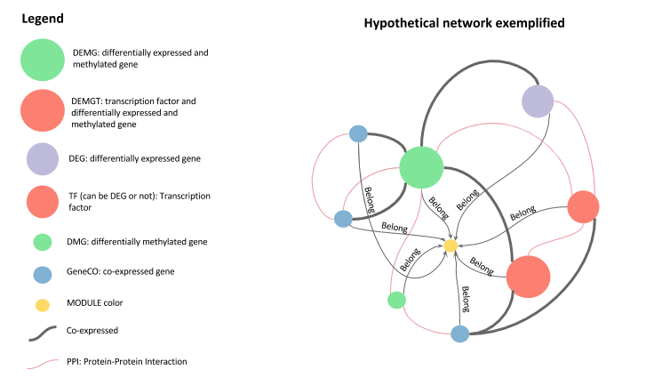

# Head-neck-squamous-cell-carcinome co-expression network of HPV+ samples

### Introduction

Head-neck-squamous cell carcinoma is heterogeneous cancer which affects around 300,000 people in the word per year. Among the risk factors are smoking, alcohol and HPV infections. The TCGA (The Cancer Genome Atlas) is paramount of data collection of more than 30 cancer types. The diversity of omic layers, such as RNA-seq, methylation, miRNA, proteomic, clinical, copy number variation and mutation, can be analyzed in different aspects including mathematical models, machine learning, and data model. 

The manuscript was submitted to `GigaScience`. The preprint version can be read in [Arxiv:](). The graph data model (`Neo4j` database) was chosed to be easier to explore the connectivity among genes in the co-expressed network. This model consists mainly of nodes, edges, and properties.  

### Network data model 

### Neo4j

Neo4j is a highly scalable, robust (fully ACID) native graph database. Neo4j is used in mission-critical apps by thousands of leading, startups, enterprises, and governments around the world.

### How to use

#### Install `Neo4j` (version 2.3.4) locally.

Visit the site: (https://neo4j.com/release-notes/neo4j-2-3-4/) and get the instruction how to download and unzip Neo4j.

#### Put the database

The database directory `hdscc.db` can be moved to `neo4j-community-xxx/data/`

#### Change the configuration

You need change the configuration. 

* Open the archive `/conf/neo4j-server.properties`
* Change the line: `org.neo4j.server.database.location=data/graph.db` to `org.neo4j.server.database.location=data/hpv.db`
* Save and close the archive

#### Start and use the database

* Start Neo4j in: `./bin/neo4j start` 
* Open the browser and write the locahost in 7474 port. (http://localhost:7474)

### Simple queries

There are many possibilities of queries in a graph database. Here are some sample Cypher queries.

Show all genes with are co-expressed and have PPI interactions:

    MATCH (g:GENE)-[r:PPI_interaction]-(h:GENE)-[r2:Co_expression]-(g) 
    RETURN count(g)
    
Find the gene connections among two modues via PPI:

    MATCH (m:MODULE)-[r0:Belong]-(g:GENE)-[r:PPI_interaction]-(h:GENE)-[r2:Belong]-(mo:MODULE) 
    WHERE m.name="YellowHPV+" AND mo.name= "BlueHPV+" 
    RETURN DISTINCT g, m, h, mo

### Contact
If you have any consideration for this work which can improve the quality, please let us know! Thanks ;-)

Contact quelopes@gmail.com. 
<!-- Ask questions and please report any bug you find. -->
<!-- MATCH (m:MODULE)-[r0:Belong]-(g:GENE)-[r:PPI_interaction]-(h:GENE)-[r2:Co_expression]-(g) WHERE m.name="BlueHPV+" return g -->
<!-- MATCH (m:MODULE)-[r0:Belong]-(g:GENE)-[r:PPI_interaction]-(h:GENE)-[r2:Co_expression]-(g) WHERE m.name="YellowHPV+" return g -->
